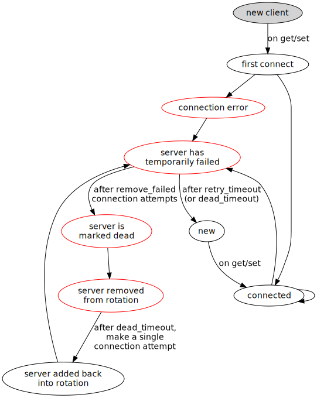

.. _behaviors:

===========
 Behaviors
===========

libmemcached is a lot more flexible than python-memcached, and has provisions
for configuring so-called *behaviors*. :mod:`pylibmc` wraps these in a Python
interface.

Not all of the available behaviors make sense for Python, or are hard to make
use of, and as such some behaviors have been intentionally hidden or exposed in
some other way (UDP and the binary protocol are examples of this.)

Generally, a behavior's value should be an integer value. The exceptions are
hashing and distribution, which :mod:`pylibmc` translates with the C constants'
string equivalents, for readability.

Other than that, the behaviors are more or less one to one mappings of
libmemcached behavior constants.

.. _hash:

``"hash"``
   Specifies the default hashing algorithm for keys. See Hashing_ for more
   information and possible values.

.. _distribution:

``"distribution"``
   Specifies different means of distributing values to servers. See
   Distribution_ for more information and possible values.

.. _ketama:

``"ketama"``
   Setting this behavior to ``True`` is a shortcut for setting ``"hash"`` to
   ``"md5"`` and ``"distribution"`` to ``"consistent ketama"``.

.. _ketama_weighted:

``"ketama_weighted"``
   Exactly like the ``"ketama"`` behavior, but also enables the weighting
   support.

.. _ketama_hash:

``"ketama_hash"``
   Sets the hashing algorithm for host mapping on continuum. Possible values
   include those for the ``"hash"`` behavior.

.. _buffer_requests:

``"buffer_requests"``
   Enabling buffered I/O causes commands to "buffer" instead of being sent. Any
   action that gets data causes this buffer to be be sent to the remote
   connection. Quiting the connection or closing down the connection will also
   cause the buffered data to be pushed to the remote connection.

.. _no_block:

``"no_block"``
   Enables asychronous I/O. This is the fastest transport available for storage
   functions.

.. _tcp_nodelay:

``"tcp_nodelay"``
   Setting this behavior will enable the ``TCP_NODELAY`` socket option, which
   disables Nagle's algorithm. This obviously only makes sense for TCP
   connections.

.. _cas:

``"cas"``
   Enables support for CAS operations.

.. _verify_keys:

``"verify_keys"``
   Setting this behavior will test if the keys for validity before sending to
   memcached.

.. _connect_timeout:

``"connect_timeout"``
   In non-blocking mode, this specifies the timeout of socket connection
   in milliseconds.

.. _receive_timeout:

``"receive_timeout"``
   "This sets the microsecond behavior of the socket against the SO_RCVTIMEO
   flag.  In cases where you cannot use non-blocking IO this will allow you to
   still have timeouts on the reading of data."

.. _send_timeout:

``"send_timeout"``
   "This sets the microsecond behavior of the socket against the SO_SNDTIMEO
   flag.  In cases where you cannot use non-blocking IO this will allow you to
   still have timeouts on the sending of data."

.. _num_replicas:

``"num_replicas"``
   Poor man's high-availability solution. Specifies numbers of replicas that
   should be made for a given item, on different servers.

   "[Replication] does not dedicate certain memcached servers to store the
   replicas in, but instead it will store the replicas together with all of the
   other objects (on the 'n' next servers specified in your server list)."

.. _dead_timeout:

``"dead_timeout"``
    Once a server has been marked dead, wait this amount of time (in seconds)
    before checking to see if the server is alive again.

.. _remove_failed:

``"remove_failed"``
   If set, a server will be removed from the server list after this many
   operations on it in a row have failed. See the section on Failover_.

.. _failure_limit:

``"failure_limit"`` : deprecated
   Use ``"remove_failed"`` if at all possible, which has the same meaning but
   uses newer behaviour.

   If set, a server will be removed from the server list after this many
   operations on it in a row have failed.

.. _auto_eject:

``"auto_eject"`` : deprecated
   Use ``"remove_failed"`` if at all possible.

   With this behavior set, hosts which have been disabled will be removed from
   the list of servers after ``"failure_limit"``.

Hashing
-------

Basically, the hasher decides how a key is mapped to a specific memcached
server.

The available hashers are:

* ``"default"`` - libmemcached's home-grown hasher
* ``"md5"`` - MD5
* ``"crc"`` - CRC32
* ``"fnv1_64"`` - 64-bit FNV-1_
* ``"fnv1a_64"`` - 64-bit FNV-1a
* ``"fnv1_32"`` - 32-bit FNV-1
* ``"fnv1a_32"`` - 32-bit FNV-1a
* ``"murmur"`` - MurmurHash_

If :mod:`pylibmc` was built against a libmemcached using
``--enable-hash_hsieh``, you can also use ``"hsieh"``.

.. _hashing-and-python-memcached:

Hashing and python-memcached
~~~~~~~~~~~~~~~~~~~~~~~~~~~~

python-memcached up until version 1.45 used a CRC32-based hashing algorithm not
reproducible by libmemcached. You can change the hasher for python-memcached
using the cmemcache_hash_ module, which will make it not only compatible with
cmemcache_, but also the ``"crc"`` hasher in libmemcached.

python-memcached 1.45 and later incorporated ``cmemcache_hash`` as its default
hasher, and so will interoperate with libmemcached provided the libmemcached
clients are told to use the CRC32-style hasher. This can be done in
:mod:`pylibmc` as follows::

    >>> mc.behaviors["hash"] = "crc"

.. _FNV-1: http://en.wikipedia.org/wiki/Fowler_Noll_Vo_hash
.. _MurmurHash: http://en.wikipedia.org/wiki/MurmurHash
.. _cmemcache_hash: http://pypi.python.org/pypi/cmemcache_hash
.. _cmemcache: http://gijsbert.org/cmemcache/
.. _hsieh: http://www.azillionmonkeys.com/qed/hash.html

Distribution
------------

When using multiple servers, there are a few takes on how to choose a server
from the set of specified servers.

The default method is ``"modula"``, which is what most implementations use.
You can enable consistent hashing by setting distribution to ``"consistent"``.

Modula-based distribution is very simple. It works by taking the hash value,
modulo the length of the server list. For example, consider the key ``"foo"``
under the ``"crc"`` hasher::

    >>> servers = ["a", "b", "c"]
    >>> crc32_hash(key)
    3187
    >>> 3187 % len(servers)
    1
    >>> servers[1]
    'b'

However, if one was to add a server or remove a server, every key would be
displaced by one - in effect, changing your server list would more or less
reset the cache.

Consistent hashing solves this at the price of a more costly key-to-server
lookup function, `last.fm's RJ explains how it works`__.

__ http://www.last.fm/user/RJ/journal/2007/04/10/rz_libketama_-_a_consistent_hashing_algo_for_memcache_clients

Failover
--------

Most people desire the classical "I don't really care" type of failover
support: if a server goes down, just use another one. This case is supported,
but not by default. As explained above, the default distribution mechanism is
not very smart, and libmemcached doesn't support any meaningful failover for
it. If a server goes down, it stays down, and all of its allotted keys will
simply fail. The recommended failover behaviors is for that reason::

    mc.behaviors['ketama'] = True
    mc.behaviors['remove_failed'] = 1
    mc.behaviors['retry_timeout'] = 1
    mc.behaviors['dead_timeout'] = 60

This will enable ketama hashing, and remove failed servers from rotation on
their first failure, and retry them once every minute. It is the most robust
configuration.

To fully understand the failover state machine, peruse the following graph:

While it might seem daunting at first, a closer examination will bring clarity
to this picture. When a server connection fails, the server is marked as
temporarily failed. This state is exited either by ``retry_timeout`` expiring,
in which case the connection is retried, or, if ``remove_failed`` connection
attempts have been made.

When a server runs out of retries, it is marked dead. This removes it from
rotation. However, **only** the ``ketama`` distribution actually removes
servers.

.. note:: There used to be two behaviors called ``failure_limit`` and
          ``auto_eject``; these still exist, but their interaction with the
          state machine is unclear, and should be avoided. ``remove_failed``
          acts as a combination of the two.

Non-libmemcached Behaviors
--------------------------

It wouldn't make sense to have multiple avenues of configuration, and so
whenever possible, pylibmc tries to co-opt the behaviors dictionary for
configuration of strictly pylibmc-level things. These are described below.

.. _pickle_protocol:

``"pickle_protocol"``
   Specifies the default pickling protocol. This is by default set to -1, which
   means the pickle module will use the latest protocol it understands. This is
   an issue for interoperability, and so for example to work between Python 2
   and 3, set this explicitly to 2 or whatever you prefer.
